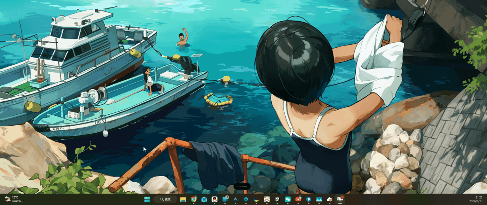
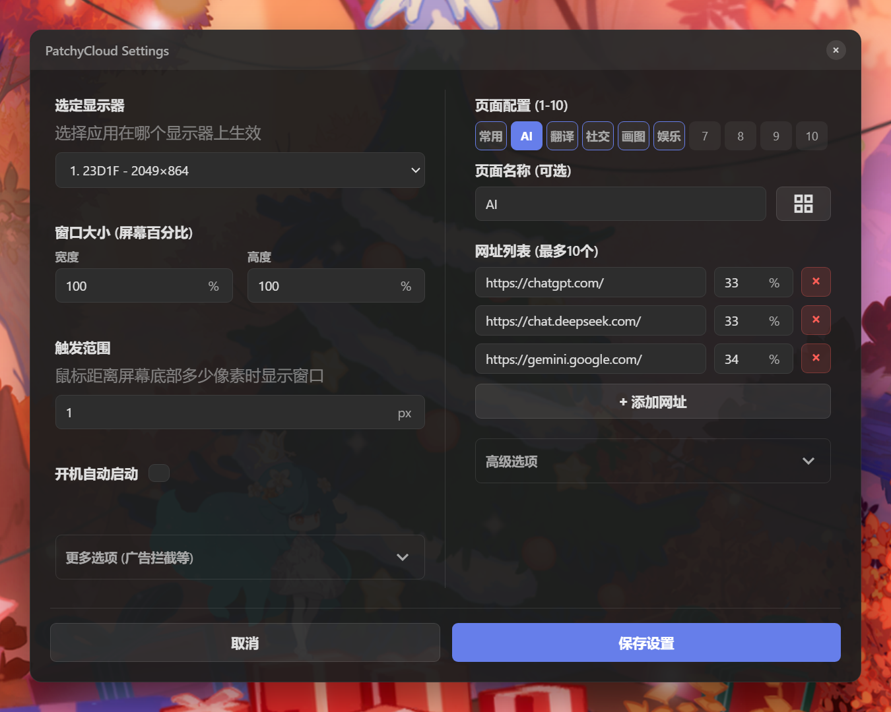

# PatchyCloud - 啪唧云菜单


一个基于Electron的跨平台桌面应用，非常适合垂直排布的多屏幕setup。
提供隐藏式浮动Web浏览器功能。当鼠标移动到屏幕底部边缘时，应用会从屏幕外滑入显示指定网站内容，不使用时自动隐藏，不影响其他软件的正常使用。
侧边工具栏支持配置多达10个独立的页面，通过工具栏快速切换，每个页面也可并排配置多个网页。



推荐用于配合开源项目MacroDeck使用，从而获得一个快捷面板：
https://github.com/Macro-Deck-App/Macro-Deck

也可以自己创建一个本地的HTML，通过多个iframe组合你喜欢的工具，然后引用你的本地地址。

## 功能特点

- 🖱️ **智能触发** - 鼠标靠近屏幕底部边缘时自动显示
- 📌 **窗口锁定** - 支持锁定窗口保持显示，方便长时间操作
- 📑 **多页签支持** - 支持设置多达10个独立的页面，通过顶部工具栏快速切换
- 🏷️ **个性化标签** - 支持自定义页面名称，内置 **100+ Material 图标库**
- 📟 **分屏浏览** - 每个页面支持配置多个网页链接，并自定义每个网页的宽度占比
- 🛡️ **广告拦截** - 内置网络广告拦截（AdBlock）与 YouTube 广告自动跳过
- 🧩 **脚本扩展** - 支持注入自定义 JavaScript 脚本，实现无限的个性化功能
- ⚙️ **灵活配置** - 选定显示器、自定义窗口大小（百分比）、触发灵敏度
- 🔧 **系统托盘** - 便捷的设置和退出选项
- 🔋 **开机自启** - 支持设置开机自动启动

## 安装和运行

### 直接使用

下载最新的 `.exe` 单文件版本直接运行即可。

### 开发环境运行

1. **克隆项目**
```bash
git clone https://github.com/titidatiti/PatchyCloud.git
```

2. **安装依赖**
```bash
npm install
```

3. **运行应用**
```bash
npm start
```

### 构建可执行文件

**构建Windows版本 (Portable):**
```bash
npm run build-win
```

构建完成后，可执行文件将保存在`dist`目录中。

## 使用说明

### 首次运行设置

1. 运行应用后会自动弹出设置窗口（或者右键托盘图标进入设置）。



2. **常规设置**：
    - **选定显示器**: 选择在哪个屏幕上显示。
    - **窗口大小**: 分别设置窗口占据屏幕的宽度和高度百分比。
    - **触发范围**: 鼠标距离底部多少像素时触发显示。
    - **开机自动启动**: 是否随系统启动。
3. **更多选项** (点击展开)：
    - **网络广告拦截**: 开启底层请求过滤，拦截常见广告（实验性功能）。
    - **YouTube 广告跳过**: 自动检测并点击 YouTube 视频广告的“跳过”按钮。
4. **页面配置**：
    - **页面名称**: 为页面起一个名字，或者点击右侧的 **图标按钮** 选择一个图标，设置后工具栏将直接显示该图标。
    - **网址列表**: 每个页签下可以添加多个网址。
    - **宽度占比**: 为每个网址输入宽度的百分比（例如两个网页各50%则平分窗口），同一页签下的所有网页宽度之和必须为 **100%**。
    - **高级选项**: 在此处可以输入自定义 JavaScript 脚本，页面加载完成后会自动执行。
5. 点击"保存设置"生效。

### 日常使用

- **显示应用**: 将鼠标移动到屏幕底部边缘。
- **锁定窗口**: 通过工具栏的图钉按钮 📌 锁定窗口，使其保持显示。
- **切换页面**: 鼠标悬停在顶部工具栏的数字/图标按钮上，或点击切换不同的页面组。
- **隐藏应用**: 鼠标移出应用窗口区域，应用自动隐藏（未缩定时）。

### 系统托盘

应用运行时会在系统托盘显示图标，提供：
- **自定义设置** - 打开设置窗口。
- **退出软件** - 完全退出应用。

## 配置文件

应用配置自动保存在用户数据目录：
- **Windows**: `%APPDATA%/PatchyCloud/config.json`

## 故障排除

### 常见问题

**Q: 多个网页如何排版？**

A: 在设置中，同一个页签下添加多个网址，并为它们分别指定宽度百分比（如 30%, 70%）。应用会自动将它们横向排列。

**Q: 展开啪唧云窗口后，窗口下的其他软件窗口会遮住开始菜单**

A: 这是Windows平台下自带的特性，当有置顶应用出现时，开始菜单会自动降级，导致层级低于其他普通窗口，目前暂无解决方法。